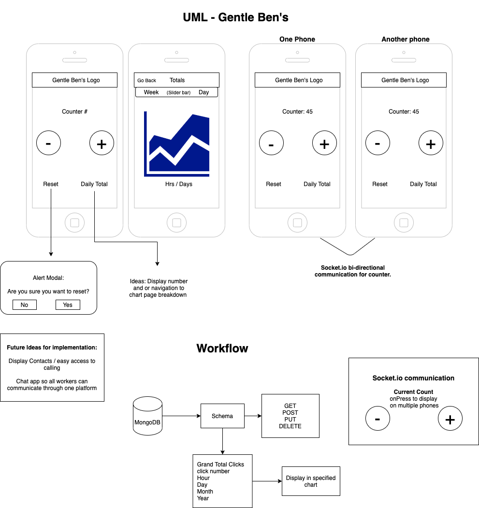

<h1 align="center"> People Counter / Chat App for Gentle Ben's Brewery in Tucson, AZ

</h1>

**Using Redux React Native**

- Redux (dispatch(action) -> reducer -> new state -> re-render

Features

- Foot Traffic Counter (+ -)

- Chart / day, week, month, year

- 2 page navigation

Author: Stacy Burris

- Created to track daily traffic and make for an easy platform for communication from all staff

Technologies:

- React
- React Native
- Redux
- Expo

Links & References:

- [Tutorials Capital](https://tutorialscapital.com/)

- [Pressable](https://reactnative.dev/docs/pressable)

- [createStackNavigator](https://reactnavigation.org/docs/stack-navigator/)

- [React Navigation](https://reactnavigation.org/docs/navigation-prop/)

Contact

[Portfolio](https://stacys-portfolio.netlify.app/) 👩🏼‍💻

[Email](stacy1burris@gmail.com) 📥

[LinkedIn](https://www.linkedin.com/in/stacyjburris/) 👔
